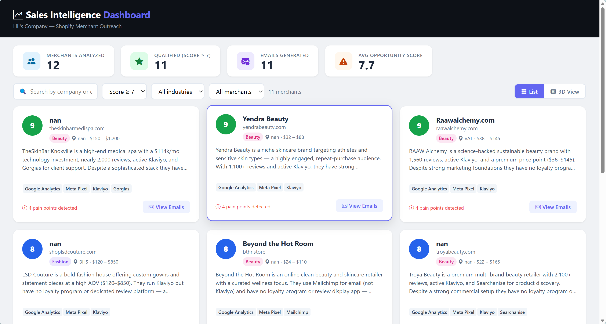
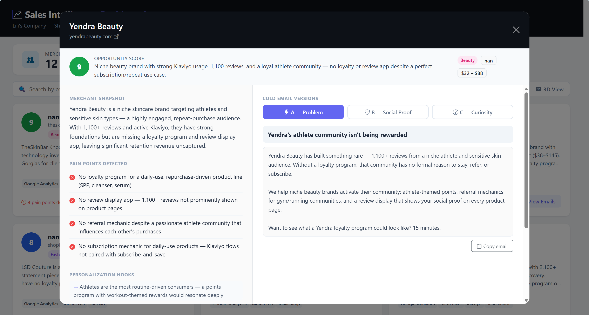

# Shopify 商家销售情报系统 — 项目思路文档

> 作者：Lili's Company
> 语言：Python 3.12
> 核心技术：Claude AI · ChromaDB · BeautifulSoup · Flask

---

## Demo





---

## 一、项目背景与核心问题

### 我们在解决什么问题？

假设你有一款 Shopify SaaS 产品（比如一个帮助商家做邮件营销 + 忠诚度计划的 App），
你想找到最适合推销的潜在客户。

**传统方法的痛点：**
- 手动浏览数百个商家网站，效率极低
- 发出去的冷邮件千篇一律，转化率极差
- 不知道哪些商家真正有痛点、愿意付费
- 没有系统筛选机制，浪费大量销售时间

**本项目的解决思路：**

```
原始数据（数百个商家）
        ↓  筛选目标行业
精准商家列表（几十个）
        ↓  爬取官网获取真实数据
丰富的商家画像
        ↓  Claude AI 分析购买意图
机会评分 + 痛点分析
        ↓  Claude AI 生成个性化邮件
三版冷邮件（A/B/C测试）
        ↓  向量数据库存储，支持自然语言查询
可持续复用的知识库
        ↓  AI Agent 全自动编排上述流程
campaign.csv（随时可发送的外发清单）
```

---

## 二、整体架构：六阶段流水线

```
tech_stack.csv
      │
      ▼ [第一阶段] 筛选
filter_shopify_merchants.py  ──→  shopify_merchants.csv
      │
      ▼ [第二阶段] 爬取
scrape_merchants.py  ──→  merchant_enrichment.json
      │
      ▼ [第三阶段] 分析
analyze_merchants.py  ──→  merchant_analysis.json
      │
      ▼ [第四阶段] 生成邮件
generate_emails.py  ──→  merchant_emails.json
      │
      ▼ [第五阶段] 向量化
build_rag.py  ──→  chroma_db/（向量数据库）
      │
      ▼ [第六阶段] AI Agent 编排
sales_agent.py  ──→  campaign.csv（最终外发清单）
      │
      ▼ [可视化]
dashboard.py  ──→  http://localhost:5000（网页界面）
```

---

## 三、各阶段详细说明

---

### 第一阶段：筛选商家 `filter_shopify_merchants.py`

#### 要解决的问题
原始数据集（`tech_stack.csv`）包含数百甚至数千行商家记录，
我们只关心：
1. **使用 Shopify 平台**的商家（技术栈匹配）
2. **属于目标行业**（时尚 / 美妆等）

#### 数据来源
`tech_stack.csv` — 一份商业数据集，记录各网站使用的技术栈。
可以从以下渠道获取：
- [BuiltWith](https://builtwith.com/)（付费）
- [Datanyze](https://www.datanyze.com/)（付费）
- [Hunter.io](https://hunter.io/)
- 自行爬取（SimilarWeb / Wappalyzer）
- 使用项目内置的"数据采集 Prompt"向数据供应商定制

#### 实现方案
```python
# 核心逻辑：两步过滤
df[df["technologies"].str.contains("Shopify")]           # 过滤技术栈
df[df["title"].str.contains("fashion|beauty", case=False)]  # 过滤行业关键词
```

**关键设计决策：**
- 用 `title`（页面标题）而非专门的行业列来判断行业，因为真实数据集通常没有干净的行业分类
- 使用关键词列表（可自定义），灵活适配不同产品的目标市场
- 输出只保留 5 列：`business_name, domain, title, country, tech_spend`

#### 输出
`shopify_merchants.csv` — 精准目标商家列表（从数百行缩减到几十行）

---

### 第二阶段：爬取商家网站 `scrape_merchants.py`

#### 要解决的问题
CSV 里的数据是静态的、可能过时的。
我们需要**实时获取**商家的真实状态：
- 他们现在在用什么营销工具？
- 有没有评价系统？有没有忠诚度计划？
- 卖什么产品？价格区间？有没有博客？

#### 实现方案：双引擎爬取

**引擎一：Firecrawl API（优先，需要付费 API Key）**
- 优点：能处理 JavaScript 渲染的页面、返回干净的 Markdown 格式
- 使用场景：商家网站使用 React/Next.js 等前端框架时

**引擎二：BeautifulSoup（免费，自动降级）**
- 解析 HTML，提取 meta 标签、链接、文本
- 无需 API Key，适合大多数 Shopify 商家（服务端渲染）

```python
# 降级逻辑
if FIRECRAWL_API_KEY:
    data = scrape_with_firecrawl(url)  # 优先使用 Firecrawl
if not data:
    data = scrape_with_bs4(url)         # 自动降级到 BeautifulSoup
```

#### 提取的数据字段

| 字段 | 提取方式 | 用途 |
| --- | --- | --- |
| `description` | meta description 标签 | AI 分析商家定位 |
| `products` | `/collections/` 链接 | 了解产品类目 |
| `tools_detected` | 脚本 src 正则匹配 | 发现技术栈缺口 |
| `price_range` | 页面价格正则提取 | 判断商家规模 |
| `blog_topics` | `/blog/` 链接文本 | 了解内容营销方向 |
| `social_proof` | 评价数量正则匹配 | 评估品牌信任度 |

#### SaaS 工具识别（22种）

通过页面 HTML 中的脚本域名来判断商家是否在用某个工具：

```python
TOOL_SIGNATURES = {
    "Klaviyo":  r"klaviyo\.com",           # 邮件营销
    "Yotpo":    r"yotpo\.com",             # 评价系统
    "Smile.io": r"smile\.io|cdn\.sweettooth",  # 忠诚度
    "Gorgias":  r"gorgias\.com",           # 客服
    # ... 共 22 种工具
}
```

**核心洞察：** 如果商家没有 Klaviyo → 邮件营销工具销售机会；没有 Yotpo/Judge.me → 评价工具机会。
这些"缺口"就是我们的销售切入点。

#### 速率限制
- 每个请求间隔 2 秒（避免被封 IP）
- 超时 10 秒后跳过（避免卡在无响应的网站）

#### 输出
`merchant_enrichment.json` — 以域名为 key 的富化数据字典

---

### 第三阶段：AI 分析商机 `analyze_merchants.py`

#### 要解决的问题
拿到商家的原始数据后，需要判断：
- 这个商家**值不值得跟进**？（机会评分 1-10）
- 他们的**痛点是什么**？（缺什么工具？运营上有什么问题？）
- **如何个性化接触**？（用什么话题开场？）

#### 为什么用 AI 而不是规则引擎？
规则引擎（比如"没有 Klaviyo 就加一分"）只能做简单判断。
Claude 可以综合理解：商家的品牌定位、产品价格带、所在市场、技术栈组合，
给出**有业务洞察的**分析，而不是机械打分。

#### 实现方案

**模型：** `claude-opus-4-6`（最强分析能力）
**思考模式：** `thinking: {type: "adaptive"}`（自适应深度推理）
**输出格式：** 要求 Claude 返回 JSON（方便后续程序处理）

**Prompt 结构：**
```
你是一位 SaaS 销售情报分析师。

商家信息：{merchant_data}
我们的产品：{saas_description}

请分析并返回 JSON：
1. MERCHANT SNAPSHOT — 2-3句话描述商家
2. PAIN POINTS DETECTED — 3-5个技术/运营痛点
3. OPPORTUNITY SCORE — 1-10分 + 一句话理由
4. PERSONALIZATION HOOKS — 3个可以在外发中引用的具体细节
5. RECOMMENDED APPROACH — 最佳联系渠道/时机/价值主张
```

#### 技术细节
- 使用**流式输出**（streaming）避免 HTTP 超时
- 自动剥离 Claude 返回中的 Markdown 代码围栏（```json ... ```）
- 解析失败时保存原始文本，不中断整个流程

#### 输出
`merchant_analysis.json` — 每个商家一条结构化分析记录

---

### 第四阶段：生成冷邮件 `generate_emails.py`

#### 要解决的问题
分析出来了痛点，还需要**把它变成可以发出去的邮件**。
普通模板邮件打开率极低（<5%）；个性化邮件打开率可达 20-35%。

#### 三版 A/B/C 测试策略

| 版本 | 策略 | 适合场景 |
| --- | --- | --- |
| A — 问题驱动 | 开门见山指出痛点 | 理性决策者、技术负责人 |
| B — 社会证明 | 引用相似客户的成功案例 | 风险规避型决策者 |
| C — 好奇心钩子 | 用一个挑衅性问题开场 | 创始人、品牌主理人 |

生成三版是为了做 A/B/C 测试，找出对不同商家类型效果最好的开场方式。

#### 邮件规则（写入 Prompt）
- 主题行：不超过 8 个词，不用 emoji，不能有推销感
- 开场：必须引用商家的具体信息（不能是通用模板）
- 正文：最多 4 句话，没有废话
- CTA：只有一个行动号召，低门槛（"15分钟聊一聊？"而非"预约 demo"）
- 语气：像同行之间的平等对话，而不是供应商推销

#### 输出
`merchant_emails.json` — 每个商家三版完整邮件（主题 + 正文）

---

### 第五阶段：向量数据库 `build_rag.py`

#### 要解决的问题
前四个阶段把商家数据处理成了结构化分析，
但如果想随时用自然语言查询（比如"找美妆商家里没有评价 App 的"），
就需要一个**语义搜索**系统。

#### 为什么用 RAG（检索增强生成）？
- SQL 查询需要精确字段名，不适合模糊语义查询
- 关键词搜索匹配不了同义词（"评价"和"review"）
- RAG 把文本转换成向量，基于语义相似度检索

#### 实现方案：ChromaDB + 本地嵌入模型

**向量数据库：** ChromaDB（本地持久化，无需云服务）
**嵌入模型（双选）：**
- 优先：OpenAI `text-embedding-3-small`（效果更好，需要 API Key）
- 降级：`sentence-transformers all-MiniLM-L6-v2`（完全免费，本地运行）

#### 分块策略（每个商家切成 4 块）

| 块名 | 内容 | 适合查询类型 |
| --- | --- | --- |
| `::identity` | 商家名、描述、产品、价格、国家 | "卖护肤品的商家" |
| `::techstack` | 工具列表、Tech spend、工具标志位 | "没有忠诚度计划的商家" |
| `::social` | 博客、评价数、是否有 testimonials | "有活跃博客的商家" |
| `::full` | 以上三块合并 | 宽泛的综合查询 |

**为什么要分块？**
把整个商家档案放进一个向量，查询精度会降低。
分块后，不同类型的问题可以命中最相关的那一块。

#### 元数据过滤
每个块都附带结构化元数据，支持精确过滤：
```python
metadata = {
    "has_reviews": "True/False",
    "has_loyalty": "True/False",
    "has_email":   "True/False",
    "industry":    "fashion/beauty/other",
    "company_size": "micro/small/medium/large",
}
```

#### 输出
`chroma_db/` — 本地向量数据库目录，支持自然语言查询

---

### 第六阶段：AI Sales Agent `sales_agent.py`

#### 要解决的问题
前五个阶段是**分步手动运行**的流水线。
能不能有一个 Agent，自己决定执行顺序，把一切串联起来？

#### 设计思路：工具调用（Tool Use）

给 Claude 配备 4 个工具，让它自主编排：

```
用户输入："找时尚商家里没有邮件营销的"
        ↓
Claude 决定：
  1. 调用 search_merchants("时尚 无邮件营销")
  2. 对每个结果调用 scrape_website(domain)
  3. 对每个结果调用 analyze_merchant(domain, profile)
  4. 只对评分 >= 7 的调用 generate_email(domain, analysis)
  5. 汇报结果
```

**Agent 不是硬编码流程**，是 Claude 根据工具返回的结果
自己判断下一步该做什么。

#### 工具设计

| 工具 | 内部调用 | 数据流向 |
| --- | --- | --- |
| `search_merchants(query, top_k)` | `build_rag.py → query_merchants()` | RAG 返回候选列表 |
| `scrape_website(domain)` | `scrape_merchants.py → enrich_domain()` | 写入 `_campaign[domain]["enrichment"]` |
| `analyze_merchant(domain, profile)` | `analyze_merchants.py → analyze_merchant()` | 写入 `_campaign[domain]["analysis"]` |
| `generate_email(domain, analysis)` | `generate_emails.py → generate_emails()` | 写入 `_campaign[domain]["emails"]` |

#### 共享状态设计
所有工具共享一个 Python 字典 `_campaign`，
工具运行时写入，Agent 结束后统一导出 CSV。
这样避免了工具之间互相传递大量数据，Claude 只需传递 `domain` 作为 key。

#### 手动 Agentic Loop（而非自动 Tool Runner）
```python
while True:
    response = stream → get_final_message()
    if stop_reason == "end_turn": break       # Claude 做完了
    if stop_reason == "tool_use":             # Claude 要调用工具
        执行所有工具调用
        把结果返回给 Claude
        继续循环
```
手动 Loop 的优势：可以打印实时进度、可以插入自定义逻辑、可以在工具执行前后做额外处理。

#### 输出
`campaign.csv` — 按评分排序，只包含评分 ≥ 7 的商家，含三版邮件

---

### 可视化层：`dashboard.py` + `templates/dashboard.html`

#### 要解决的问题
JSON 和 CSV 文件对非技术人员不友好。
需要一个界面让销售团队能直接查看、筛选、复制邮件。

#### 技术选型

**后端：Flask**（Python 轻量级 Web 框架）
- 3 个路由：主页面、商家数据 API、统计数据 API
- 自动合并所有输出文件，返回统一格式的 JSON

**前端：纯 HTML + Bootstrap 5 + 原生 JS**
- 无需 npm / webpack / React — 零构建步骤
- 所有样式从 CDN 加载
- 原生 `fetch()` 调用 Flask API，动态渲染内容

#### 界面功能

| 功能 | 实现方式 |
| --- | --- |
| 统计栏 | `/api/stats` 返回总数/合格数/邮件数 |
| 商家卡片网格 | `/api/merchants` 返回数据，JS 动态生成 HTML |
| 搜索筛选 | 纯前端过滤（不重新请求 API，实时响应） |
| 评分颜色 | CSS 变量：绿（≥9）蓝（≥7）灰（<7） |
| 详情弹窗 | Bootstrap Modal + JS 填充内容 |
| A/B/C 邮件切换 | JS Tab 切换，点击复制调用 `navigator.clipboard` |

---

## 四、数据流全景图

```
[原始数据]
tech_stack.csv（由第三方数据商提供，或自行爬取）
      │
      ▼
[筛选] — 关键词匹配 Shopify + 行业
shopify_merchants.csv（12个目标商家）
      │
      ├──────────────────────────────────────────┐
      ▼                                          ▼
[爬取] 访问每个商家官网               [向量化] 把商家档案
merchant_enrichment.json             嵌入 ChromaDB
（工具、价格、产品、评价）            （用于语义搜索）
      │
      ▼
[AI 分析] Claude 评分 + 找痛点
merchant_analysis.json
（评分、快照、钩子、建议）
      │
      ▼
[生成邮件] Claude 写三版冷邮件
merchant_emails.json
（A/B/C 各有主题 + 正文）
      │
      ▼
[Agent 编排] 全自动串联上述步骤
campaign.csv（只含高分商家，随时可发）
      │
      ▼
[Dashboard] 可视化查看 + 一键复制邮件
http://localhost:5000
```

---

## 五、关键技术决策及原因

### 为什么用 Claude 而不是 GPT？

| 维度 | Claude 优势 |
| --- | --- |
| 指令遵循 | 更严格遵循 JSON 格式要求，减少解析错误 |
| 长上下文 | 200K Token 窗口，适合处理大型商家档案 |
| 分析深度 | 自适应思考（Adaptive Thinking）让分析更有洞察力 |
| Tool Use | 官方 SDK 对 Tool Use 支持完善，Agent 编排稳定 |

### 为什么选 ChromaDB 而不是 Pinecone / Weaviate？

- **本地运行**，无需注册云账号，无需付费，无数据隐私顾虑
- 文件持久化（`chroma_db/` 目录），重启不丢失
- Python 原生集成，与项目其他部分无缝配合
- 对于几十到几百个商家的规模，性能完全够用

### 为什么每个商家切 4 个块？

单一向量无法同时优化所有查询类型：
- 查"卖护肤品的" → `::identity` 块命中率更高
- 查"没有忠诚度计划的" → `::techstack` 块命中率更高
- 宽泛查询 → `::full` 块兜底

4 块策略在存储代价（4倍）和查询精度之间取得平衡。

### 为什么生成三版邮件（A/B/C）？

冷邮件开场方式对转化率影响巨大，但最佳方式因人而异：
- 技术/运营负责人 → 更响应"问题驱动"（Version A）
- 保守型决策者 → 更响应"社会证明"（Version B）
- 创始人/品牌主理人 → 更响应"好奇心钩子"（Version C）

提前生成三版，销售人员可以根据对方职位灵活选择，或同时测试。

---

## 六、运行方式总结

### 一次性全流程运行

```bash
# 环境准备
pip install pandas anthropic requests beautifulsoup4 chromadb sentence-transformers flask

# 设置 API Key
export ANTHROPIC_API_KEY="your-key"

# 第一步：筛选目标商家
python filter_shopify_merchants.py

# 第二步：爬取官网数据
python scrape_merchants.py

# 第三步：AI 分析商机
python analyze_merchants.py

# 第四步：生成冷邮件
python generate_emails.py

# 第五步：建立向量数据库
python build_rag.py build

# 第六步：运行 AI Agent（全自动编排）
python sales_agent.py --criteria "时尚商家 无邮件营销"

# 查看结果
python dashboard.py   # 打开 http://localhost:5000
```

### 只想测试界面（不花 API 费用）

```bash
python create_sample_data.py   # 为 shopify_merchants.csv 里的真实商家生成样本数据
python dashboard.py             # 打开 http://localhost:5000
```

---

## 七、可扩展方向

| 方向 | 实现思路 |
| --- | --- |
| 接入真实发件系统 | 在 `campaign.csv` 基础上对接 SendGrid / Mailchimp API |
| 定时自动运行 | 用 cron job 定期执行 `filter → scrape → analyze` |
| 支持更多行业 | 修改 `--industries` 参数，扩展到母婴、宠物、运动等 |
| 商家评分历史追踪 | 加入数据库（SQLite）记录每次分析结果，追踪评分变化 |
| 多语言邮件 | 在 Email Prompt 中加入语言参数，支持法语、德语等 |
| Slack 通知 | Agent 完成后推送高分商家摘要到 Slack Channel |
| 更大数据集 | 更换 tech_stack.csv 为更大的数据源，系统可线性扩展 |

---

*本文档描述了从原始商业数据到可发送的个性化外发邮件的完整自动化路径。*
*每个阶段都可以独立运行，也可以通过 sales_agent.py 全自动编排。*
